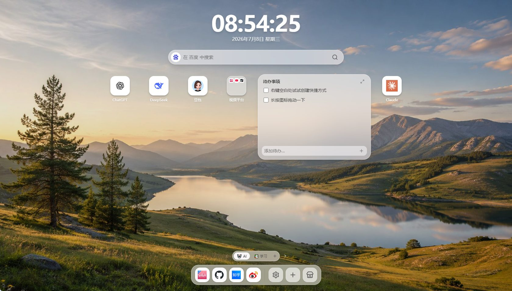

<p align="center">
  
</p>

<h1 align="center">PaTab</h1>

<p align="center">
  <strong>一块屏幕，装下你的整个工作台</strong>
</p>

<p align="center">
  将浏览器新标签页变成一个类桌面的工作空间——书签、搜索、待办、文件夹以磁贴形式铺在眼前，像使用手机桌面一样自然。
</p>

<p align="center">
  
  
  
  
  
  
</p>

---

## 📸 预览

| 💻 桌面端 | 📱 移动端 |
|:---:|:---:|
|  |  |

---

## ✨ 核心特性

- **🖥️ 多屏桌面** —— 8×4 网格磁贴布局，多个屏幕自由分页，每屏可自定义名称与 emoji。支持紧凑、自由两种布局模式随心切换。
- **🔍 一站式搜索** —— 内置百度、必应、谷歌等 7+ 搜索引擎，支持自定义引擎模板。搜索框实时联想建议，输入即可直达。
- **📁 文件夹收纳** —— 拖拽快捷方式即可归类，3×3 迷你预览一眼看清内容，告别杂乱的浏览器书签栏。
- **✅ 内置待办** —— 智能列表与自定义清单，支持日期排期、星标标记与拖拽排序，完成任务有清脆的反馈提示。
- **🖱️ Mac 风格 Dock** —— 高频网站常驻底部 Dock 栏，悬停显示名称，设置与快捷添加入口触手可及。
- **🎨 主题切换** —— 支持浅色 / 深色 / 跟随系统三种主题模式，毛玻璃与色彩变量贯穿全局。
- **🌐 中英双语** —— 界面语言支持中文与英文一键切换，文案按模块拆分管理。
- **🔒 隐私优先** —— 所有数据保存在浏览器本地 localStorage，无需注册账号、不上传服务器、不追踪行为。
- **🧩 浏览器扩展** —— 支持 Chrome / Edge Manifest V3 新标签页扩展，接管新标签页获得最完整体验。
- **📦 组件商店** —— 内置可扩展组件商店，小组件按需安装，桌面个性化灵活组合。

---

## 🛠️ 技术栈

| 层面 | 技术 |
|:---|:---|
| 前端框架 | Vue 3 + Composition API |
| 构建工具 | Vite 8 |
| 类型系统 | TypeScript 6.0 |
| 状态管理 | Pinia 3 |
| 样式方案 | Tailwind CSS 4.3 |
| 图标库 | Lucide Vue |
| 动效 | motion-v |
| 国际化 | vue-i18n |
| 测试 | Vitest + @vue/test-utils + jsdom |
| 介绍站 | React 19 + GSAP + Vite |
| 扩展 | Chrome/Edge Manifest V3 |

---

## 📂 项目结构

```text
patab/
├── patab-web/                 # 🏠 主应用（Vue 3 + Vite）
│   ├── public/                #    静态资源（Logo、壁纸等）
│   ├── src/
│   │   ├── components/        #    Vue 组件（screen / dock / modals / settings / topbar / widgets / common）
│   │   ├── composables/       #    组合式函数（拖拽、主题、时间等交互逻辑）
│   │   ├── stores/            #    Pinia 状态（launcher 领域模块 + UI 瞬时状态）
│   │   ├── i18n/              #    中英文翻译资源
│   │   ├── types/             #    全局 TypeScript 类型定义
│   │   ├── utils/             #    纯工具函数（URL、图标、网格、壁纸、搜索引擎等）
│   │   └── __tests__/         #    单元测试
│   ├── extension/             #    Chrome/Edge MV3 扩展清单
│   └── vite.config.ts
│
├── patab-introduction/        # 🌐 介绍站（React + Vite + GSAP）
│   ├── public/                #    静态资源（截图、安装页面、法律文档）
│   ├── src/
│   │   ├── components/        #    React 组件（sections / layout / common）
│   │   └── data/              #    特性、展示、技术亮点等数据
│   └── index.html
│
├── docs/                      # 📚 项目文档
│   ├── ARCHITECTURE.md        #    架构说明与模块职责
│   ├── STYLE.md               #    代码风格与组件化规范
│   └── SECURITY.md            #    安全规范
│
├── .claude/                   # Claude Code 配置
├── .agents/                   # 代理配置
└── AGENTS.md                  # 代理指令
```

---

## 🚀 快速开始

### 环境要求

- **Node.js** `^22.18.0 || >=24.12.0`
- **pnpm** 包管理器

### 启动主应用（patab-web）

```bash
cd patab-web
pnpm install
pnpm dev          # 开发服务器启动在 http://localhost:6109
```

### 启动介绍站（patab-introduction）

```bash
cd patab-introduction
pnpm install
pnpm dev          # 开发服务器启动在 http://localhost:6108
```

### 构建

```bash
# 主应用 - 网页版
cd patab-web
pnpm build
# 主应用 - 浏览器扩展版
pnpm build:extension

# 介绍站
cd patab-introduction
pnpm build
```

### 运行测试

```bash
cd patab-web
pnpm test:unit
```

---

## 📖 使用方式

| 方式 | 说明 |
|:---|:---|
| **在线网页版** | 直接在浏览器中打开网页版，无需安装 |
| **Chrome 插件版** | 从 Chrome 应用商店安装，接管新标签页 |
| **Edge 插件版** | 从 Edge 外接程序安装，接管新标签页 |
| **离线安装包** | 下载 `.zip`，开发者模式手动加载扩展 |

> 插件版即将上架 Chrome 应用商店和 Edge 外接程序。

---

## 🤝 贡献

新功能开发前请先阅读：

- [`docs/ARCHITECTURE.md`](docs/ARCHITECTURE.md) —— 了解架构和依赖方向
- [`docs/STYLE.md`](docs/STYLE.md) —— 编码规范与组件化标准
- [`docs/SECURITY.md`](docs/SECURITY.md) —— 安全约束与持久化规则

提交前务必通过构建和测试：

```bash
cd patab-web
pnpm build && pnpm test:unit
```

---

## 📄 许可证

本项目基于 [MIT 许可证](license) 开源。

© 2026 yan5236
