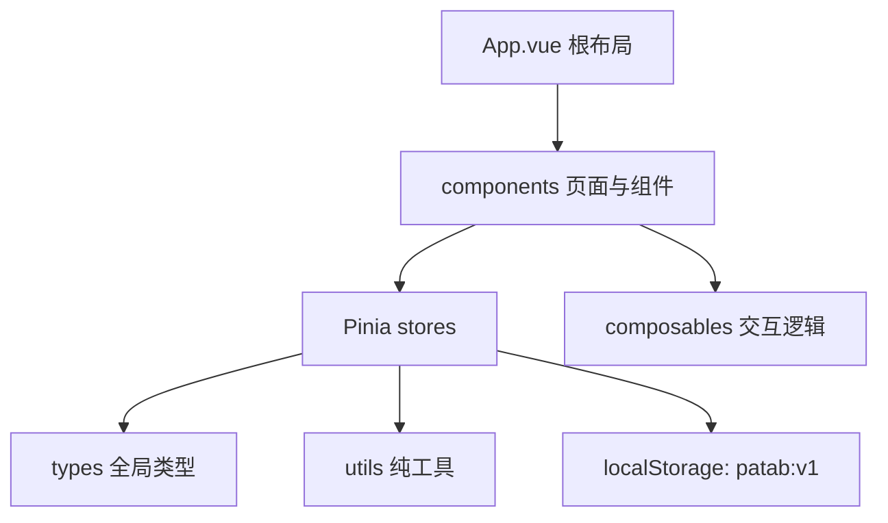

# PaTab 架构说明

## 总体架构

## 模块职责

- `patab-web/src/App.vue`：根组件，负责壁纸、主布局和全局弹层挂载。
- `patab-web/src/components/`：界面组件，按 common、dock、modals、screen、settings、topbar、widgets 拆分。
- `patab-web/src/stores/launcher.ts`：业务数据中枢，管理屏幕、Dock、待办、设置和持久化。
- `patab-web/src/stores/ui.ts`：全局 UI 状态，管理弹窗、菜单等临时界面状态。
- `patab-web/src/stores/drag.ts`：拖拽过程状态。
- `patab-web/src/composables/`：复杂交互逻辑，例如拖拽、网格翻转、时间刷新。
- `patab-web/src/types/index.ts`：跨组件共享的数据结构。
- `patab-web/src/utils/`：URL、图标、网格、ID、壁纸、搜索引擎等可复用纯函数。
- `patab-web/src/__tests__/`：单元测试。

## 依赖方向

- 组件可以依赖 store、composable、type、utils。
- store 可以依赖 type 和 utils，不依赖组件。
- utils 保持纯函数优先，不依赖 Vue 组件或 Pinia store。
- type 不依赖业务实现。

## 组件化边界

- 前端 UI 必须优先抽象为可复用 Vue 组件，再在页面或业务容器中组合。
- 通用视觉壳、按钮、弹窗、菜单、图标、面板等放入 `components/common/` 或更合适的现有子目录。
- 业务组件只保留本业务的编排逻辑，重复出现的结构、样式和交互必须下沉为小组件。
- 组件只通过 props、emit、slot 和 store/composable 暴露必要接口，避免组件之间互相读取内部实现。
- 新增组件前先查找现有组件，能复用或轻微扩展现有组件时不新建平行组件。

## 数据流

1. 组件触发用户操作。
2. 组件调用 Pinia action 或 composable。
3. store 更新 `screens`、`dock`、`todos`、`settings`。
4. `launcher` store 通过防抖写入 `localStorage`。
5. 组件响应式刷新界面。

## 当前状态

- 已完成：主屏幕、Dock、文件夹、搜索、搜索引擎管理、组件商店、待办小组件、设置弹窗、壁纸、拖拽和 localStorage 持久化。
- 进行中：持续完善交互细节和可维护性。
- 待关注：`launcher.ts`、`useLongPressDrag.ts`、部分测试文件较长，后续大改时优先拆分。

## 新增功能规则

- 纯计算逻辑优先放到 `utils/`，并补最小单元测试。
- 可复用交互优先放到 `composables/`。
- 新 UI 只放到对应 `components/` 子目录，不把业务堆进 `App.vue`。
- 新 UI 开发默认先拆成可复用组件，页面层只负责组合和传参。
- 新增小组件默认从 Dock 右侧的组件商店进入；组件商店使用“真实小组件预览 + 名称简介 + 添加按钮”的商品卡，桌面空白右键菜单只保留屏幕管理与壁纸等基础操作。
- 新持久化字段必须更新 `types/index.ts`、默认数据、兼容逻辑和相关测试。
- 搜索引擎设置通过 `settings.searchEngines` 持久化，搜索栏使用圆形图标按钮打开自建引擎选择框；搜索地址模板统一使用 `{q}` 占位，用户清空列表时搜索框进入禁用态。
- 搜索联想由 `components/topbar/SearchSuggestions.vue` 展示，`utils/searchSuggestions.ts` 通过必应 JSONP 接口取词；所有搜索引擎共用联想源，但提交搜索仍使用当前引擎模板。
