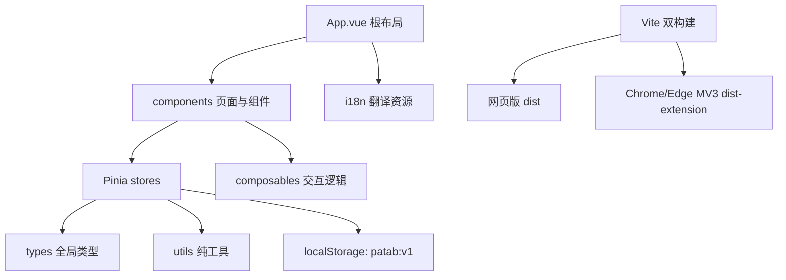

# PaTab 架构说明

## 总体架构

## 模块职责

- `patab-web/src/App.vue`：根组件，负责壁纸、主布局和全局弹层挂载。
- `patab-web/src/components/`：界面组件，按 common、dock、modals、screen、settings、topbar、widgets 拆分。
- `patab-web/src/components/common/AppDropdown.vue`：全局通用单选下拉框，设置语言等需要统一视觉的选择项优先复用它。
- `patab-web/src/i18n/`：Vue I18n 实例、语言清洗工具和按模块拆分的中英文 JSON 翻译资源。
- `patab-web/src/stores/launcher.ts`：持久业务状态门面，创建状态、组装领域 action，并保留组件调用的稳定 API。
- `patab-web/src/stores/launcherState.ts`：launcher 默认数据、localStorage 读取和旧数据兼容清洗。
- `patab-web/src/stores/launcherPlacement.ts`：launcher 主屏坐标落位、清坐标和紧凑回填辅助。
- `patab-web/src/stores/launcherQueries.ts`：launcher 屏幕、文件夹、快捷方式和容器的只读查询。
- `patab-web/src/stores/launcherTiles.ts`：launcher 快捷方式、文件夹、小组件、屏幕和 Dock 的业务动作。
- `patab-web/src/stores/launcherTodos.ts`：launcher 待办条目和待办列表的业务动作。
- `patab-web/src/stores/launcherDrop.ts`：launcher 拖拽落点、批量拖拽和跨容器移动规则。
- `patab-web/src/stores/launcherSettings.ts`：launcher 设置补丁写入入口。
- `patab-web/src/stores/ui.ts`：全局 UI 状态，管理弹窗、菜单等临时界面状态。
- `patab-web/src/stores/drag.ts`：拖拽过程状态。
- `patab-web/src/composables/`：复杂交互逻辑，例如拖拽、网格翻转、时间刷新。
- `patab-web/src/types/index.ts`：跨组件共享的数据结构。
- `patab-web/src/utils/`：URL、图标、网格、ID、壁纸、搜索引擎等可复用纯函数。
- `patab-web/src/utils/runtimeEnvironment.ts`：识别当前运行在网页版还是 Chrome/Edge 扩展页。
- `patab-web/src/utils/assetPath.ts`：统一解析 public 静态资源路径，扩展版通过 `chrome.runtime.getURL` 访问内置资源。
- `patab-web/src/__tests__/`：单元测试。
- `patab-web/extension/manifest.json`：Chrome/Edge Manifest V3 新标签页扩展清单，只在扩展构建时复制到 `dist-extension/`。
- `patab-introduction/`：React + Vite 介绍站，负责产品首页、安装教程、隐私政策和文档等公开说明页。

## 依赖方向

- 组件可以依赖 store、composable、type、utils。
- 组件内用户可见文案通过 `vue-i18n` 读取，翻译资源按 common、settings、topbar、screen、dock、modals、todo、widgets 等模块拆分。
- store 可以依赖 type 和 utils，不依赖组件。
- utils 保持纯函数优先，不依赖 Vue 组件或 Pinia store。
- type 不依赖业务实现。
- 扩展版只允许通过极薄运行环境工具适配资源和浏览器限制，不复制 Vue 业务代码。

## 组件化边界

- 前端 UI 必须优先抽象为可复用 Vue 组件，再在页面或业务容器中组合。
- 通用视觉壳、按钮、弹窗、菜单、图标、面板等放入 `components/common/` 或更合适的现有子目录。
- 业务组件只保留本业务的编排逻辑，重复出现的结构、样式和交互必须下沉为小组件。
- 组件只通过 props、emit、slot 和 store/composable 暴露必要接口，避免组件之间互相读取内部实现。
- 新增组件前先查找现有组件，能复用或轻微扩展现有组件时不新建平行组件。

## 数据流

1. 组件触发用户操作。
2. 组件调用 Pinia action 或 composable。
3. store 更新 `screens`、`dock`、`todos`、`settings`。
4. `launcher` store 通过防抖写入 `localStorage`。
5. 组件响应式刷新界面。

## 当前状态

- 已完成：主屏幕、Dock、文件夹、搜索、搜索引擎管理、组件商店、待办小组件、设置弹窗、壁纸、时钟日期显示、中英文界面语言、拖拽和 localStorage 持久化。
- 已完成：Chrome/Edge Manifest V3 新标签页扩展构建，扩展版与网页版共享同一套 Vue 源码。
- 已完成：`patab-introduction` 介绍站首页、移动端折叠菜单、安装教程、隐私政策和文档二级页。
- 进行中：持续完善交互细节和可维护性。
- 待关注：`useLongPressDrag.ts`、部分测试文件较长，后续大改时优先拆分。

## 新增功能规则

- 纯计算逻辑优先放到 `utils/`，并补最小单元测试。
- 可复用交互优先放到 `composables/`。
- 新 UI 只放到对应 `components/` 子目录，不把业务堆进 `App.vue`。
- 新 UI 开发默认先拆成可复用组件，页面层只负责组合和传参。
- 新增小组件默认从 Dock 右侧的组件商店进入；组件商店使用“真实小组件预览 + 名称简介 + 添加按钮”的商品卡，桌面空白右键菜单只保留屏幕管理与壁纸等基础操作。
- 新持久化字段必须更新 `types/index.ts`、默认数据、兼容逻辑和相关测试。
- `launcher.ts` 后续只作为持久业务状态门面；新增查询、图块、待办、拖拽、设置、默认数据、迁移或坐标规则时优先放入现有同目录领域模块，不要继续堆回 store 主文件。
- 时钟设置通过 `settings.hour12` 与 `settings.showDate` 持久化；顶部时钟组件只负责展示，开关由通用设置面板维护。
- 语言设置通过 `settings.language` 持久化，通用设置面板使用 `AppDropdown` 切换 `zh-CN` / `en-US`；新增可见文案必须进入对应模块 JSON，不要直接写死在组件模板里。
- 搜索引擎设置通过 `settings.searchEngines` 持久化，搜索栏使用圆形图标按钮打开自建引擎选择框；搜索地址模板统一使用 `{q}` 占位，用户清空列表时搜索框进入禁用态。
- 搜索联想由 `components/topbar/SearchSuggestions.vue` 展示，`utils/searchSuggestions.ts` 通过必应 JSONP 接口取词；扩展版 fetch JSONP 文本后从必应实际包装中解析 payload；所有搜索引擎共用联想源，但提交搜索仍使用当前引擎模板。
- 主屏批量管理模式只保存在 `stores/ui.ts` 的瞬时状态中；`TileItem.vue` 负责选择圆点、点击拦截和批量右键菜单，`launcherTiles.ts` 处理批量删除，`launcherDrop.ts` 处理批量拖放规则。
- 扩展功能优先放在 Vite 构建脚本、`extension/manifest.json` 和 `utils/runtimeEnvironment.ts` / `utils/assetPath.ts` 这类薄适配层；不得为扩展版复制 App、store 或组件。
